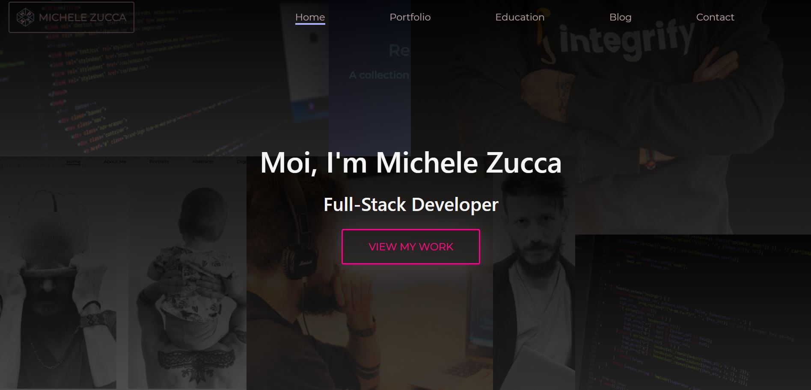
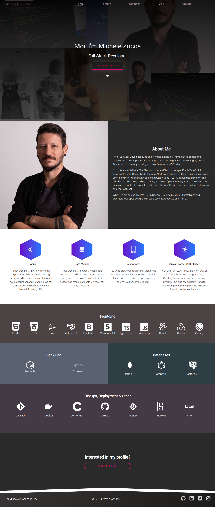
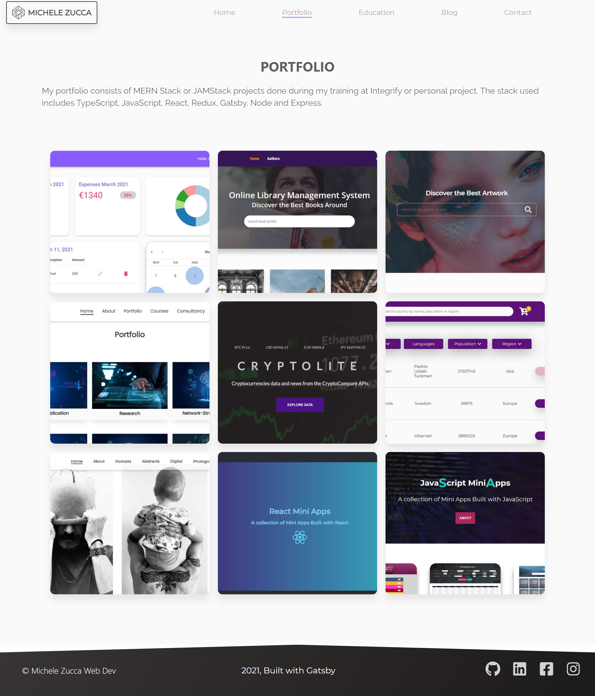
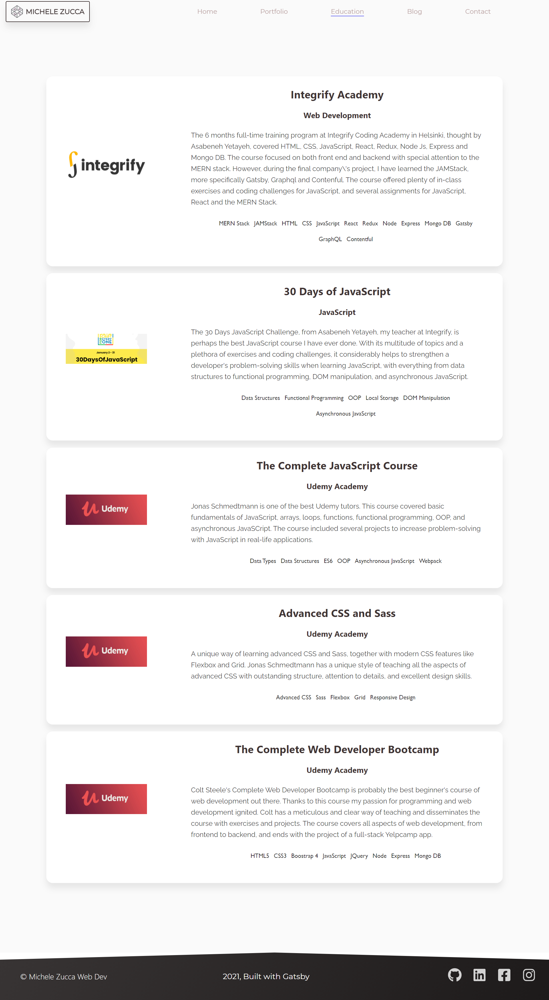
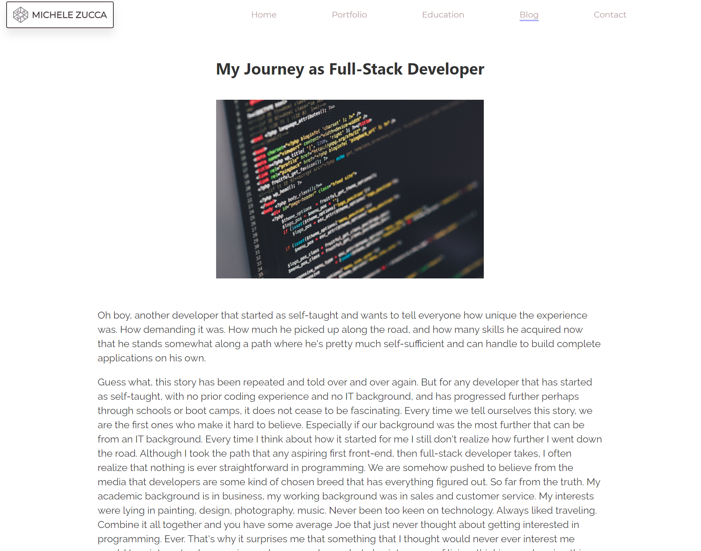
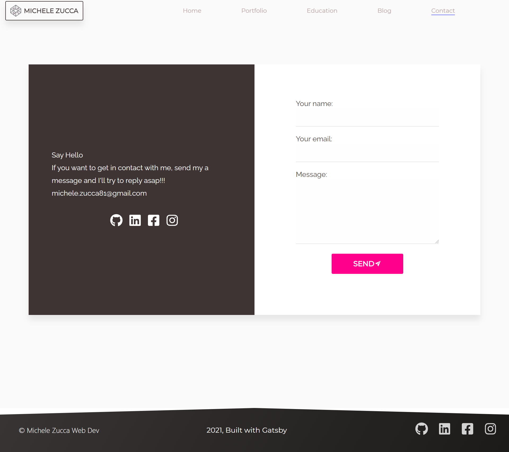

# Gatsby/TypeScript Portfolio Website

My porfolio website is the main collection that showcases my skills as full-stack developer. It displays my main projects and skills, a section about myself, my tech stack, my skills,education, a blog and a contact section. Built on JAMStack using TypeScript, Gatsby, GraphQL and Contentful, it uses the [JAMStack Boilerplate](https://github.com/tripheo0412/jamstack-typescript-boilerplate) by [Tri Hoang](https://github.com/tripheo0412)

# Table of contents:

- [Tech Stack Used](#tech-stack-used)
- [Home](#home)
- [Portfolio](#portfolio)
- [Education](#education)
- [Blog](#blog)
- [Contact](#contact)
- [CMS & Dynamic Data](#cms-&-dynamic-data)
- [Deployment](#deployment)

# Tech Stack Used

- JAMStack
- TypeScript
- Gatsby Js
- React Js
- GraphQL
- Contentful
- StoryBook
- Gatsby Plugins
- Netlify Form
- Sass

## Home

The home page shows an introduction about myself, my top skills, my tech stack and a get in touch banner which redirects to the contact me section.

## Portfolio

The portfolio sections it’s the main part of my portfolio website, as it displays all my current and past projects with demos and project details. The project items redirect directly to the project demos deployed on Heroku or Netlify. By clicking on Details, you can view a very detailed description of the project features, the tech stack used, a link to the demo and to the Github repository. PLEASE note that some of the repositories are private as these projects are done inside Integrify’s organization.

## Education

The education section displays all my courses achieved in the past in Full-Stack development, web development and also design.

## Blog

A little bit about my thoughts. This section displays my blog posts and my opinions around web development.

## Contact

## CMS & Dynamic Data

  
  
   
  

The whole portfolio website is built using dynamic data coming from the headless CMS (Content Management System) Contentful, so that all content data, including titles, logos and images in the various sections can be added or updated without ever touching the code. In this case, Contentful proved to be an amazing and easy to use CMS to add content to my portfolio website.

## Deployment

The app is deployed on Netlify and the demo can be found at the following link: https://michelezuccawebdev.netlify.app/
